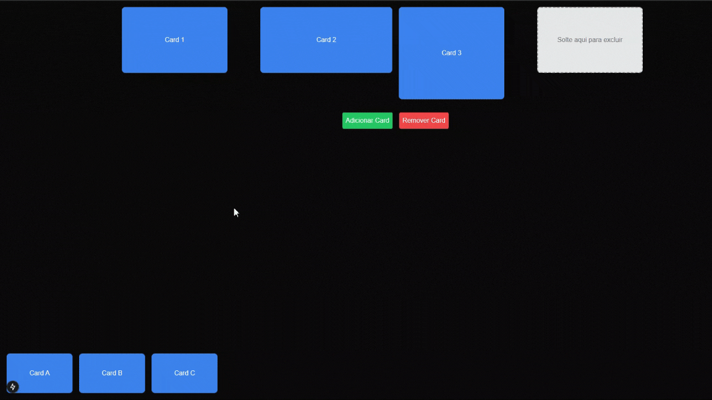

# Dashboard Interativo com drag and Drop (Arrastar e soltar) em React com Next.js

## Como Testar

### Se não estiver instalado, instale os pacotes com este comando:
```bash
npm install
```
### Execute o comando abaixo na pasta do projeto:

```bash
npm run dev
```
Abra [http://localhost:3000](http://localhost:3000) com seu navegador para ver o resultado.
